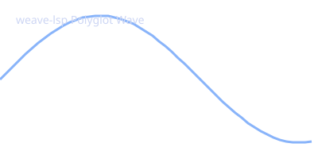

# Clojure/Python Interop and Polyglot Artifact Processing

Adopted from Atabey Kaygun's blog post: [Clojure/Python Interop Examples](https://kaygun.github.io/clean/2023-02-04-clojurepython_interop_examples.html).

## Description of the Problem

Today, I am going to write something that I have been playing around with, and found to be extremely useful and fun: deep Clojure and Python interop. While native bindings can be done via [libpython-clj](https://github.com/clj-python/libpython-clj), in `weave-lsp` we can seamlessly produce non-text file artifacts (such as images, vector graphics, datasets, or models) in Python, pass buffer data to Clojure and Common Lisp, process the generated files across languages, and embed the generated image directly into the Markdown document.

## Step 1: Generate Visual Plot & Data Artifact in Python

Here, Python calculates wave function metrics, writes a vector image artifact (`artefacts/sine_wave.svg`), and outputs a dataset file (`artefacts/metrics.json`):

```python
import math, json, os

output_dir = "artefacts" if os.path.isdir("artefacts") else "../artefacts"
os.makedirs(output_dir, exist_ok=True)
svg_file = os.path.join(output_dir, "sine_wave.svg")
metrics_file = os.path.join(output_dir, "metrics.json")

# Generate data points
x_vals = [i * 0.1 for i in range(50)]
y_vals = [math.sin(x) for x in x_vals]

# Generate binary image artifact (SVG format)
svg_content = f'''<svg xmlns="http://www.w3.org/2000/svg" width="400" height="200" style="background:#1e1e2e;">
  <path d="M 0 100 ''' + ' '.join([f'L {int(x*80)} {int(100 - y*80)}' for x, y in zip(x_vals, y_vals)]) + '''" stroke="#89b4fa" stroke-width="3" fill="none"/>
  <text x="20" y="30" fill="#cdd6f4" font-family="sans-serif" font-size="14">weave-lsp Polyglot Wave</text>
</svg>'''

with open(svg_file, "w") as f:
    f.write(svg_content)

metrics = {
    "points_count": len(x_vals),
    "min_val": round(min(y_vals), 4),
    "max_val": round(max(y_vals), 4),
    "image_artifact": "artefacts/sine_wave.svg"
}

with open(metrics_file, "w") as f:
    json.dump(metrics, f, indent=2)

print(json.dumps(metrics, indent=2))
```

> **Output [python_artifacts]**
```json
{
  "points_count": 50,
  "min_val": -0.9999,
  "max_val": 0.9996,
  "image_artifact": "artefacts/sine_wave.svg"
}
```


## Step 2: Read and Summarize Artifact File in Clojure

Next, a Clojure cell consumes the piped input buffer and reads the generated `artefacts/metrics.json` file directly from the filesystem:

```clojure
(let [metrics-path (if (.exists (java.io.File. "artefacts/metrics.json")) "artefacts/metrics.json" "../artefacts/metrics.json")
      content (slurp metrics-path)
      points (second (re-find #"\"points_count\":\s*([0-9]+)" content))
      min-val (second (re-find #"\"min_val\":\s*([-\d.]+)" content))
      max-val (second (re-find #"\"max_val\":\s*([-\d.]+)" content))
      img (second (re-find #"\"image_artifact\":\s*\"([^\"]+)\"" content))]
  (println (str "Clojure parsed " points " waveform data points in range [" min-val ", " max-val "] linked to " img)))
```

> **Output [clj_artifact_summary]**
```plaintext
Clojure parsed 50 waveform data points in range [-0.9999, 0.9996] linked to artefacts/sine_wave.svg
```


## Step 3: Read and Analyze Artifact File in Common Lisp

A Common Lisp cell also accesses the generated artifact file:

```lisp
(let* ((p1 "artefacts/metrics.json")
       (p2 "../artefacts/metrics.json")
       (path (if (probe-file p1) p1 p2)))
  (with-open-file (stream path)
    (format t "Common Lisp artifact inspection:~%")
    (loop for line = (read-line stream nil nil)
          while line do (format t "  ~a~%" line))))
```

> **Output [lisp_artifact_summary]**
```plaintext
Common Lisp artifact inspection:
  {
    "points_count": 50,
    "min_val": -0.9999,
    "max_val": 0.9996,
    "image_artifact": "artefacts/sine_wave.svg"
  }
```


## Step 4: Embedded Image Artifact


